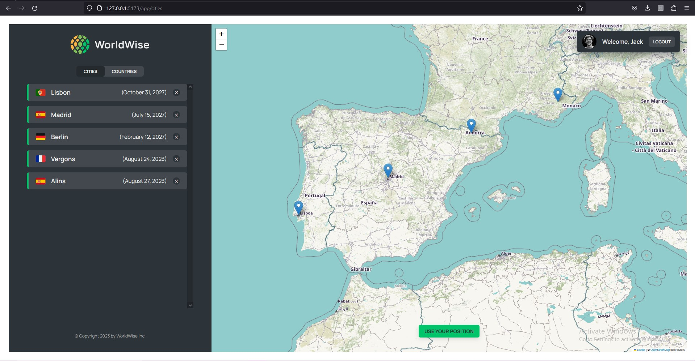

# WorldWise

### Demo Screeshots

## WorldWise is a travel tracking application that allows users to register the cities and countries they have traveled to. The application offers the following features:

- Dynamic Page Navigation: The application employs page navigation that dynamically updates the URL bar as users move between different sections. This creates a true single-page application experience.
- City and Country Lists: The application provides a list of all visited cities and the corresponding countries, dynamically retrieved and displayed based on user input.
- Interactive Maps: A map section provides users with the ability to locate their current position using geolocation APIs. Users can also view the cities they have visited as markers on the map.
- City Details: Clicking on a city marker reveals detailed information about the city, including its name, the date of the visit, personal notes, and even a Wikipedia link for further exploration.
- User-Friendly UI: The application is designed with a user-friendly interface, making it easy for users to interact with the various features and functionalities.

## Tech

- Vite Integration: WorldWise demonstrates our team's technical prowess by adopting Vite as the build tool. This change from the traditional Create React App showcases our willingness to adapt to new technologies and stay at the forefront of web development trends.
- Single-Page Application (SPA) Architecture: The project employs a SPA architecture that dynamically updates content without requiring full page reloads. This enhances user experience and speed, delivering a more responsive application.
- React Components: We utilized React components to build a modular and maintainable codebase, ensuring scalability and code reusability.
- ESLint Integration: To maintain code quality and consistency, we integrated ESLint, catching errors and enforcing best coding practices throughout the development process.
- React Router: React Router is a widely used library in the React ecosystem that provides routing capabilities for single-page applications (SPAs)
- createContext and useReducer: These are hooks provided by React to manage state and data flow within your application.

## Available Scripts

In the project directory, you can run:

### `npm run dev`

Runs the app in the development mode. 
Open [http://127.0.0.1:5173](http://127.0.0.1:5173) to view it in the browser.

### `npm run server`

Run the JSON Server

### `npm run build`

Builds the app for production to the `build` folder. 
It correctly bundles React in production mode and optimizes the build for the best performance.
